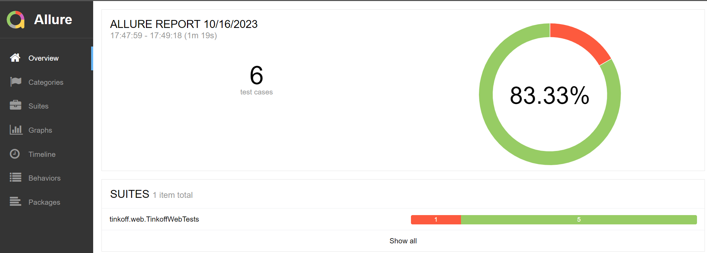
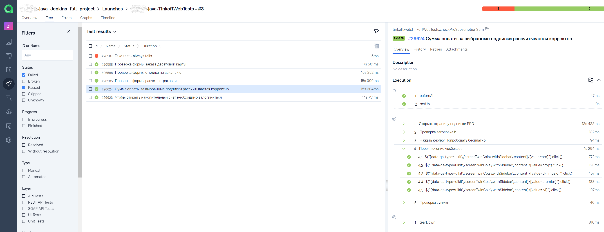

# Проект по автоматизации тестовых сценариев для Тинькофф-Банка
## :pushpin: Содержание:

- [Использованный стек технологий](#computer-использованный-стек-технологий)
- [Запуск тестов из терминала](#arrow_forward-запуск-тестов-из-терминала)
- [Сборка в Jenkins](#сборка-в-jenkins)
- [Пример Allure-отчета](#пример-allure-отчета)
- [Уведомления в Telegram с использованием бота](#уведомления-в-telegram-с-использованием-бота)
- [Видео примера запуска тестов в Selenoid](#-видео-примера-запуска-теста-в-selenoid)

## :computer: Использованный стек технологий

<p align="center">


</p>

- В данном проекте автотесты написаны на языке <code>Java</code> с использованием фреймворка для тестирования Selenide. 
- В качестве сборщика был использован - <code>Gradle</code>.  
- Использованы фреймворки <code>JUnit 5</code> и [Selenide](https://selenide.org/).
- При прогоне тестов браузер запускается в [Selenoid](https://aerokube.com/selenoid/).
- Для удаленного запуска реализована джоба в <code>Jenkins</code> с формированием Allure-отчета и отправкой результатов в <code>Telegram</code> при помощи бота. 
- Осуществлена интеграция с <code>Allure TestOps</code> и <code>Jira</code>

Содержание Allure-отчета:
* Шаги теста;
* Скриншот страницы на последнем шаге;
* Page Source;
* Логи браузерной консоли;
* Видео выполнения автотеста.

## :arrow_forward: Запуск автотестов

### Запуск тестов из терминала
```
gradle clean main_test
```
При выполнении команды, данные тесты запустятся удаленно в <code>Selenoid</code>.

### Запуск тестов на удаленном браузере
```
gradle clean clean remote_test
```
При необходимости также можно переопределить параметры запуска

```
clean
remote_test
-Dbrowser=${BROWSER}
-DbrowserVersion=${BROWSER_VERSION}
-DbrowserSize=${BROWSER_SIZE}
-DremoteDriverUrl=https://user1:1234@${REMOTE_DRIVER_URL}/wd/hub
```

### Параметры сборки

* <code>BROWSER</code> – браузер, в котором будут выполняться тесты. По-умолчанию - <code>chrome</code>.
* <code>BROWSER_VERSION</code> – версия браузера, в которой будут выполняться тесты. По-умолчанию - <code>100.0</code>.
* <code>BROWSER_SIZE</code> – размер окна браузера, в котором будут выполняться тесты. По-умолчанию - <code>1920x1080</code>.
* <code>REMOTE_DRIVER_URL</code> – адрес удаленного сервера, на котором будут запускаться тесты.

##  Сборка в Jenkins
<p align="center">

</p>

##  Пример Allure-отчета
### Overview

<p align="center">

</p>

### Результат выполнения теста

<p align="center">

</p>

##  Интеграция с Allure TestOps

Выполнена интеграция сборки <code>Jenkins</code> с <code>Allure TestOps</code>.
Результат выполнения автотестов отображается в <code>Allure TestOps</code>
На Dashboard в <code>Allure TestOps</code> отображена статистика пройденных тестов.

<p align="center">

</p>

##  Уведомления в Telegram с использованием бота

После завершения сборки, бот созданный в <code>Telegram</code>, автоматически обрабатывает и отправляет сообщение с результатом.

<p align="center">

</p>

## Видео примера запуска тестов в Selenoid

К каждому тесту в отчете прилагается видео прогона.
<p align="center">
  
</p>
